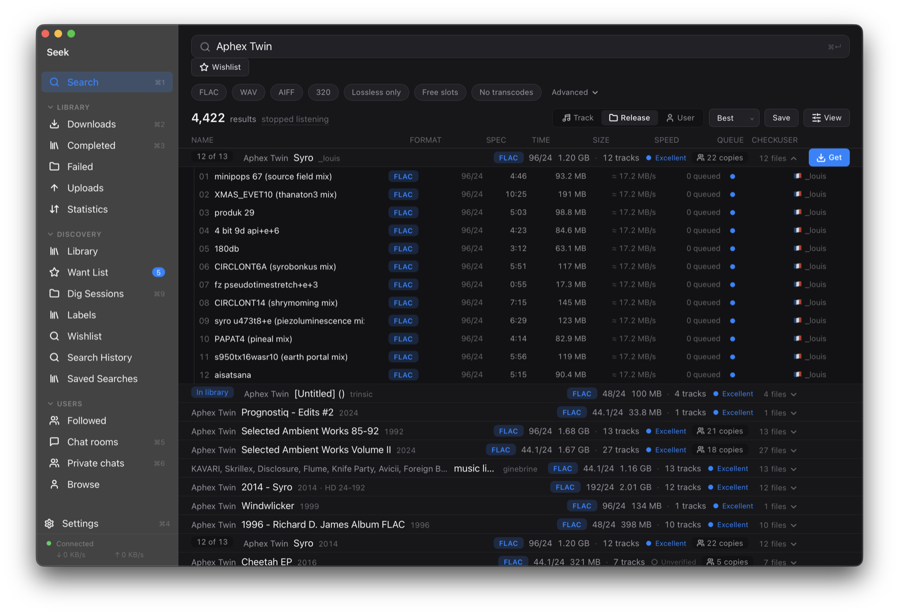
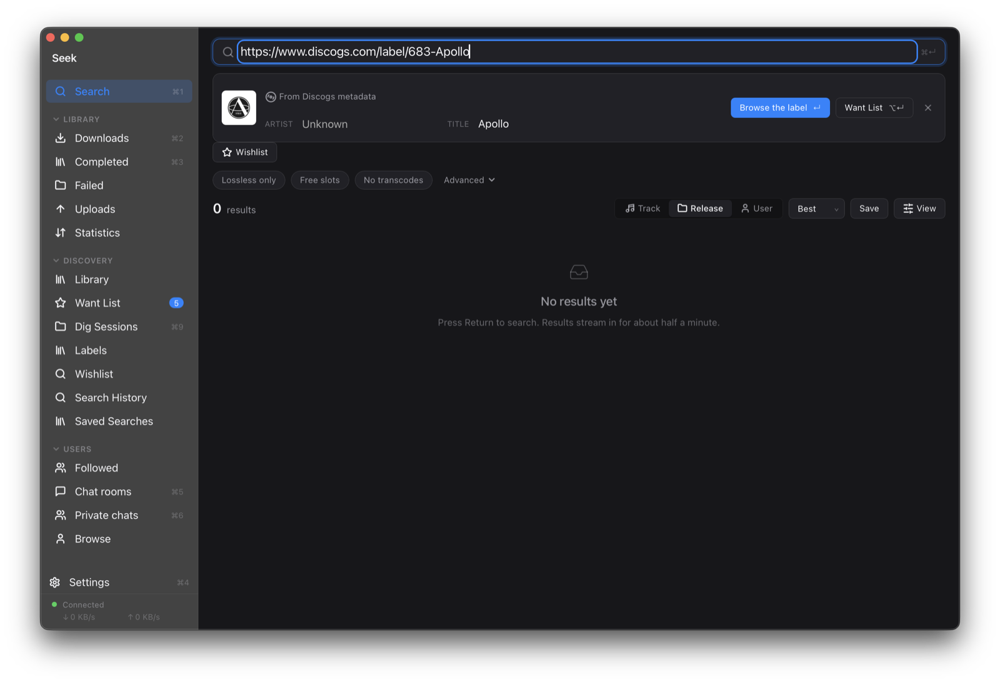
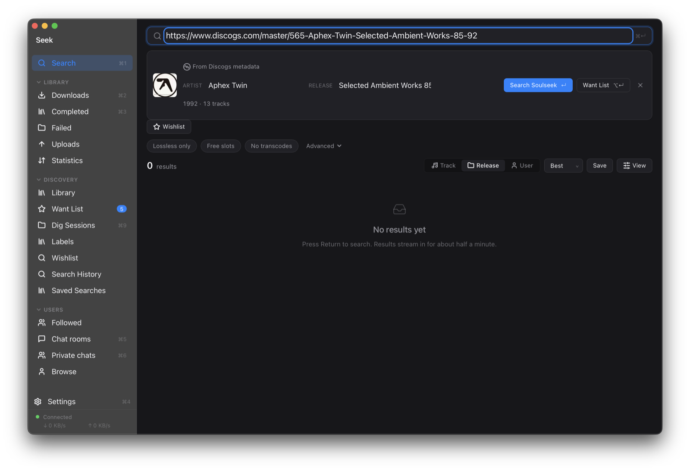
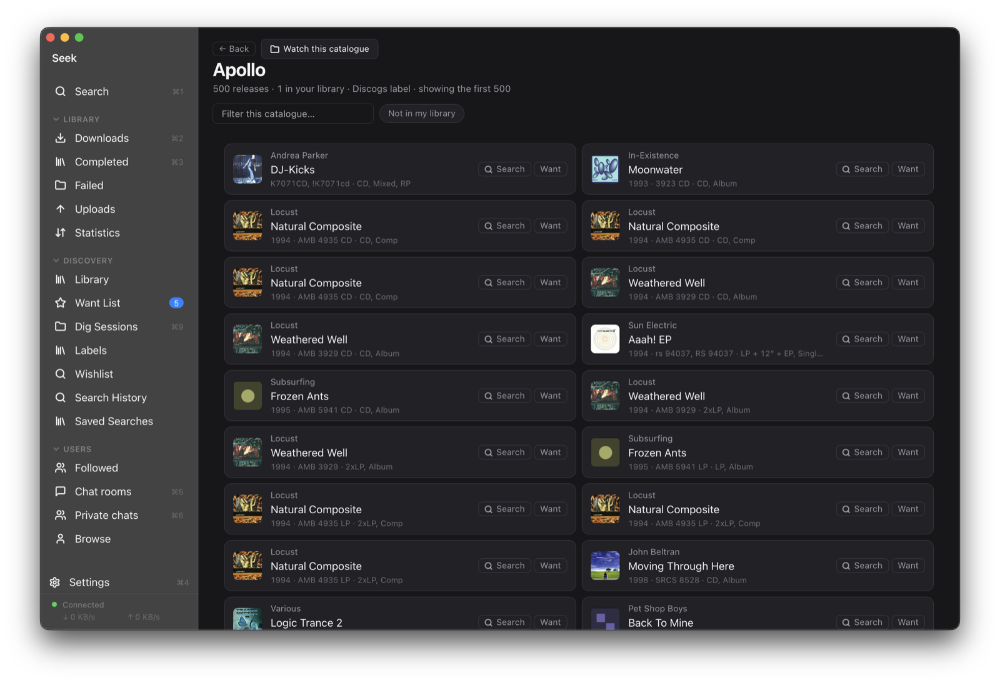
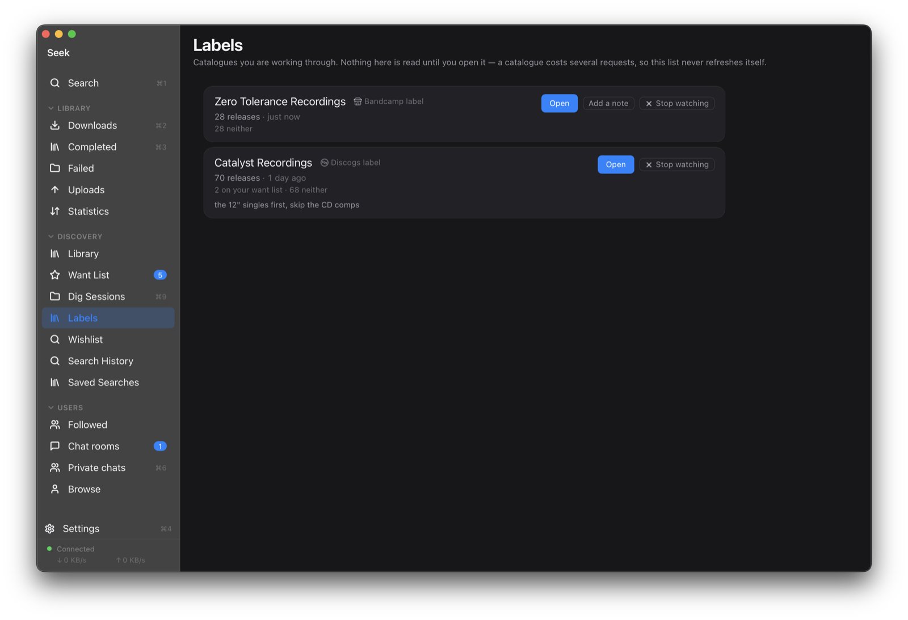
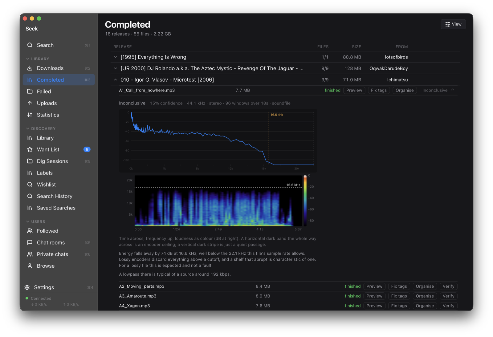
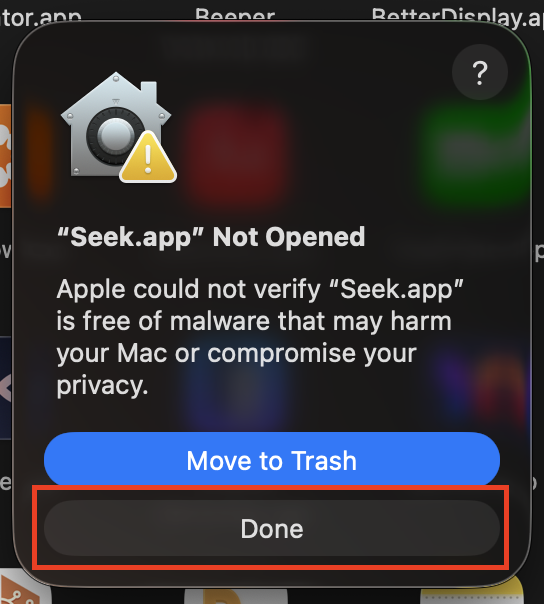
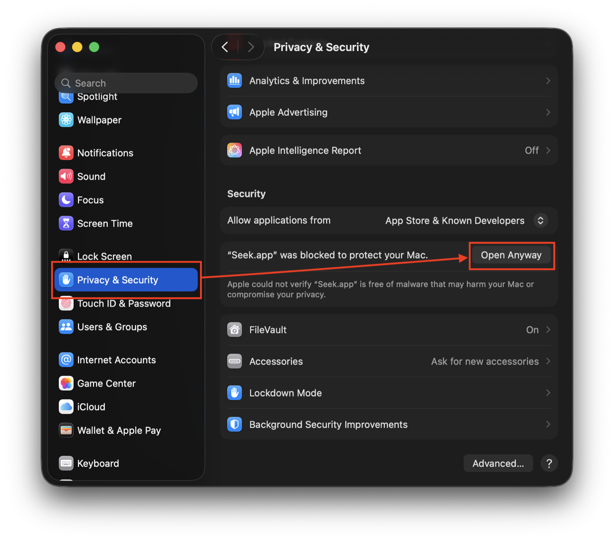
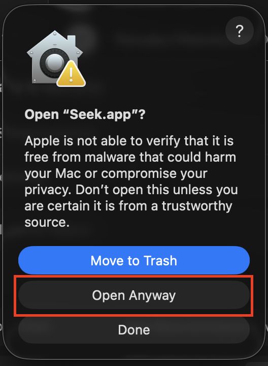

# Seek

**A Mac client for [Soulseek](https://www.slsknet.org/) built for people who dig.**
Paste a Discogs, Bandcamp or YouTube link and it becomes a search. Work through
a label's entire back catalogue. See what a file actually is before you keep it.

Built on [Nicotine+](https://nicotine-plus.org/), which does the protocol work.



> **Unofficial.** Not affiliated with, endorsed by, or connected to Soulseek or
> the Nicotine+ project. Seek uses Nicotine+ as a library and is grateful for it.

---

## Why not just use Nicotine+?

Nicotine+ is excellent and Seek runs on it. Seek is what happens when you point
that engine at one question: **how do you find a specific record, and know it is
the right one, without doing the bookkeeping yourself?**

| | |
|---|---|
| 🔗 **Records, not filenames** | Paste a link from Discogs, Bandcamp or YouTube. Seek reads the artist, title, year and tracklist off the page and searches for *that* — no retyping, no guessing at spelling. |
| 📚 **Whole catalogues** | Open a label's discography, see at a glance what you already own, and work down the list. Keep a watchlist of labels you're digging through. |
| 🔍 **Proof, not badges** | A "FLAC" that came from a 192 kbps MP3 is shown as one, with the spectrogram that says so. Seek shows its working instead of stamping a verdict. |
| 👤 **You pick the copy** | Several people have the record? You get a comparison — tracks, format, size, free slot, queue length, your own history with them. The app never quietly swaps your choice for one it prefers. |
| 🤝 **Sharing treated as the point** | Soulseek is reciprocal. Seek shows what you're uploading, what your ratio actually is, and says plainly when a slow queue is the consequence of sharing nothing. |
| 🚫 **It refuses to guess** | Where no one person has the whole album, Seek says so and shows what each person actually has, file by file. It won't claim one person's "track 4" is another's — that guess was measured against real data and was wrong more often than right. |

---

## The link features

This is the part that changes how you use Soulseek. **Paste any of these into
the search bar** and Seek reads it before you press Return.

### A label link → the whole roster



Drop in a Discogs label URL and Seek identifies the label, then offers to browse
its entire catalogue or add it to your want list.

> 🔑 **Discogs links need a free Discogs token.** [Set one up in 3 steps →](#discogs-token)
> Bandcamp label links work with **no key at all**.

### An album link → an exact search



Paste a release or master URL and Seek pulls the artist, title, year and track
count straight off the page — then searches Soulseek for that record, correctly
spelled, first time.

> 🔑 **Discogs** links need a [token](#discogs-token). **Bandcamp** album links and
> **YouTube** video links need **nothing** — they work the moment you install Seek.

### Browsing a catalogue



500 releases, and Seek already knows which ones are in your library. Filter down
to **"Not in my library"** and every row has a **Search** and a **Want** button.
This is a whole afternoon of digging in one screen.

> 🔑 **Discogs catalogues need a [token](#discogs-token). Bandcamp catalogues do not.**

### A watchlist of labels



The labels you're working through, with your progress on each — how many
releases, how many are on your want list, how many you've dealt with. Add a
note to yourself ("the 12″ singles first, skip the CD comps"). Sources are mixed
freely: Bandcamp labels and Discogs labels sit side by side.

Nothing here refreshes itself. A catalogue costs several requests, so it is read
only when you open it — deliberately, so Seek is never quietly hammering an API
in the background.

> 🔑 Watching a **Discogs** label needs a [token](#discogs-token). Watching a
> **Bandcamp** label needs nothing.

---

## Know what you actually downloaded



A file can claim any quality it likes. Seek looks at the **sound itself** —
frequency against time, loudness as colour — and tells you what it found.

That flat cliff at 16.6 kHz is an encoder ceiling: everything above it was thrown
away, which is what a lossy encoder does. Seek reads it as *"typical of a source
around 192 kbps"* and, crucially, labels its own confidence — here
**Inconclusive, 15%**. It reports what it saw, not what to think.

> ✅ **No key needed.** This runs entirely on your Mac. Nothing is uploaded, and
> it works offline.

Also here: **Preview** before you commit, **Fix tags**, and **Organise** to file
the release where it belongs.

---

## Install

Download the `.zip` from [**Releases**](../../releases), unzip it, and drag
`Seek.app` to your Applications folder.

macOS will block it the first time. Seek isn't signed with a paid Apple
Developer certificate ($99/year), so macOS quarantines it like anything else off
the internet. **Three clicks, once, and then it opens normally forever.**

### 1. Open Seek — macOS refuses. Click **Done**.



Do *not* click Move to Trash. Just Done.

### 2. Open **System Settings → Privacy & Security**, and click **Open Anyway**



Scroll to the **Security** section. You'll see *"Seek.app was blocked to protect
your Mac"* with an **Open Anyway** button beside it. That message only appears
after step 1, so don't go looking for it first.

### 3. Confirm with **Open Anyway**



That's it. Seek opens by double-click from now on.

<details>
<summary><b>Prefer one Terminal command instead?</b></summary>

```bash
xattr -dr com.apple.quarantine /Applications/Seek.app
```

It prints nothing when it works, and replaces all three steps above. It removes
the "came from the internet" tag macOS attached to the download and changes
nothing about the app itself.

</details>

<details>
<summary><b>Seeing "Seek is damaged and can't be opened"?</b></summary>

That means you have a build from before **26 Aug 2026**, and the build is the
problem rather than your Mac. Its bundle was linker-signed — the signature
covered the executable but sealed none of the resources — and Gatekeeper reads
that as corruption rather than as an untrusted app, which is why no **Open
Anyway** appears anywhere.

Download a current release. `release.sh` now refuses to produce a build that way.

</details>

**What you need:** a Soulseek account. Seek doesn't create one — sign in under
**Settings → Account**, or import an existing setup from Nicotine+.

---

## Setting up the API keys

Seek works out of the box. These unlock the features above, they're all **free**,
and each one takes a couple of minutes.

Everything is stored in Seek's own data folder, never in this repository, and
only ever leaves your Mac to reach the service it belongs to.

**All of them go in the same place: `Settings → External lookups`.**

| What you want | What you need |
|---|---|
| Bandcamp links & catalogues | ✅ Nothing |
| YouTube video links | ✅ Nothing |
| Artwork and release data (MusicBrainz, Cover Art Archive) | ✅ Nothing |
| Track analysis / spectrograms | ✅ Nothing — runs locally |
| **Discogs links, catalogues, want list import** | 🔑 [Discogs token](#discogs-token) |
| **Import a YouTube playlist** | 🔑 [YouTube Data API key](#youtube-data-api-key) |
| **Identify a file by its sound** | 🔑 [AcoustID key](#acoustid-application-key) + `brew install chromaprint` |

---

### Discogs token

The one most worth doing — Discogs is the database that actually knows
underground electronic releases.

1. Go to **[discogs.com](https://www.discogs.com/)** and sign in. (Free to
   create an account if you don't have one.)
2. Open **[discogs.com/settings/developers](https://www.discogs.com/settings/developers)**.
3. Find the section headed **Personal access token** and press
   **Generate new token**.
4. **Copy the token** it shows you — a long string of letters and numbers.
5. In Seek: **Settings → External lookups → Discogs token**, paste it, and save.

That's all. A personal token is tied to your own account and needs no app
registration or approval. Discogs allows 60 requests a minute with one; Seek
stays well under that.

---

### YouTube Data API key

Only needed to **import a playlist**. Pasting a single YouTube video link works
without it.

1. Go to **[console.cloud.google.com](https://console.cloud.google.com/)** and
   sign in with any Google account.
2. **Create a project.** Click the project dropdown in the top bar → **New
   Project** → give it any name ("Seek" is fine) → **Create**. Wait a few
   seconds, then make sure it's the selected project.
3. **Enable the API.** In the sidebar go to **APIs & Services → Library**,
   search for **"YouTube Data API v3"**, click it, and press **Enable**.
4. **Make the key.** Go to **APIs & Services → Credentials** →
   **Create credentials** → **API key**.
5. **Copy the key** it shows you.
6. In Seek: **Settings → External lookups → YouTube Data API key**, paste, save.

> ⚠️ Choose **API key**, not an OAuth client. OAuth is for reaching a Google
> account's *private* data — a public playlist needs none of it. Seek holds no
> client secret and never asks you to sign in to Google.

Optionally, click your new key and restrict it to the YouTube Data API. Google's
free tier is far more than Seek will ever use.

---

### AcoustID application key

Only needed to **identify an unlabelled file by its sound**.

1. Register an account at **[acoustid.org](https://acoustid.org/login)** (you can
   sign in with an existing account from another service).
2. Go to **[acoustid.org/new-application](https://acoustid.org/new-application)**
   and register an application. Any name will do — "Seek" or "personal use".
3. Copy the **API key shown for that application**.
4. In Seek: **Settings → External lookups → AcoustID application key**, paste,
   save.
5. Install the fingerprinting tool: `brew install chromaprint`

> ⚠️ **Use the APPLICATION key, not the API key on your profile page.** They look
> identical and the wrong one silently fails. The profile key is for *submitting*
> fingerprints, and AcoustID rejects it for lookups — but the rejection arrives
> as an empty result rather than an error, so it just looks like nothing matched.
> This cost an hour to work out while building Seek; now you don't have to.

`chromaprint` is a separate install because the tool it provides links against
Homebrew's ffmpeg and can't simply be copied into the app bundle. Everything else
in Seek works without it.

---

## Build from source

An app you build yourself is never quarantined, so this skips the install dance
entirely.

**You'll need:** macOS (Apple silicon or Intel), [Rust](https://rustup.rs/),
[Node.js](https://nodejs.org/) 20+, and Python 3.11+.

```bash
git clone --recurse-submodules <this repo>
cd seek

# the Python engine
cd sidecar
python3 -m venv .venv
.venv/bin/pip install -r requirements.txt
cd ..

# the app
cd app
npm install
npm run tauri build
```

The finished app lands in
`app/src-tauri/target/release/bundle/macos/Seek.app`.

`--recurse-submodules` matters: Nicotine+ is pinned as a submodule so a build is
reproducible. Without it the engine has nothing to talk to.

## Development

```bash
cd sidecar && PYTHONDONTWRITEBYTECODE=1 PYTHONPATH=../upstream:. \
  .venv/bin/python -m seek_sidecar --print-endpoint --allow-origin http://localhost:5273
cd app && npm run dev
```

The engine prints a host, port and token; open
`http://localhost:5273/?sidecar=127.0.0.1:<port>&token=<token>`.

```bash
cd app && npm test          # 341 tests
cd app && npm run typecheck
cd sidecar && PYTHONDONTWRITEBYTECODE=1 PYTHONPATH=../upstream:. \
  .venv/bin/pytest tests/ -q # 494 tests
```

`./release.sh` does a full release build, and refuses to continue if the frozen
engine would ship stale code or a bundle without its CA certificates.

`RECON.md` documents what the Soulseek protocol actually provides — several
things the obvious assumption gets wrong — and `docs/PRODUCT.md` is the product
spec. Both are worth reading before changing anything at the seam between the
Python engine and the TypeScript frontend.

## Your responsibility

Seek is a client. What you search for, share and download is up to you, and so
is complying with the law where you live.

## Licence

GPL-3.0-or-later. See [LICENSE](LICENSE).

Seek uses [Nicotine+](https://github.com/nicotine-plus/nicotine-plus)
(GPL-3.0-or-later) as its protocol engine, pinned as a submodule. Because a
packaged build embeds Nicotine+, the corresponding source for everything in the
app is this repository plus that pinned submodule.
