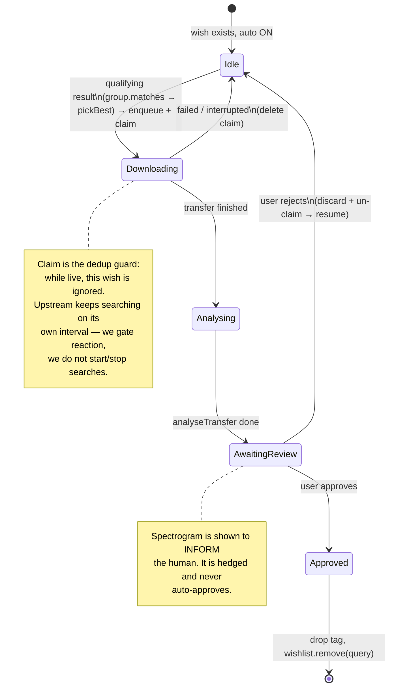

# Design: Auto Wishlist Downloads

Status: **built** (v0.2.11), app-open-only v1 as designed below. Author: Claude
(with Iva).

This maps the feature request onto Seek's **actual** architecture. The headline:
the hard parts already existed. What was added is a small reactive controller
(`data/autoDownloads.ts`), a pure planner (`domain/autoWishlist.ts`), a per-wish
`auto` flag and a claim ledger (schema + `core_host.py`), the Wishlist toggle,
and the "Awaiting review" section in Completed — not a new subsystem.

---

## TL;DR — three things to get right before any code

1. **"Continuously searches in the background" is already the Wishlist.** Upstream
   keeps one token per wish and re-runs it forever *on the server's interval*;
   `app/src/data/wishHits.ts` already ingests that stream, groups it, and dedups
   it to `fresh` (results no earlier run showed). **We do not build a search loop
   and we never poll** — running wishlist searches faster than the server's
   interval is exactly what gets a client throttled (`RECON.md`, and the header
   comment in `wishHits.ts`). Auto-download is a *consumer* of `useWishHits`.

   Consequence: "stop searching / resume searching" ≠ starting and stopping
   searches (we can't; upstream owns the timer). It means **gating our reaction**:
   while a wish has a candidate awaiting review, ignore its results. *Approve*
   removes the wish (`wishlist.remove`), which genuinely ends the upstream search;
   *reject* un-gates so the next run acts again.

2. **Auto-DOWNLOAD, never auto-APPROVE.** The spectrogram check is a *hedged*
   finding — "Unverified" is a mandatory state and `quality.ts` opens with
   "Nothing here is verified." It may **inform** the human but must never be the
   accept/reject gate. This is why the flow correctly ends at *Awaiting Review*
   with a person. The automation stops at "downloaded + analysed."

3. **The pre-download gate can only use self-reported attributes, which lie or are
   absent.** Per `RECON.md §4`, attributes arrive in two disjoint sets (lossless
   has bitDepth/sampleRate and *no* bitrate; lossy has bitrate; ~23% carry
   nothing). The existing `group.matches()` predicate already handles this
   correctly (a lossless file satisfies any bitrate floor rather than being
   excluded for a field it can't have). **Reuse it** — do not write a new gate,
   or "minimum bitrate" will silently reject every FLAC.

---

## What already exists (the substrate)

| Requirement in the request | Already in the codebase |
|---|---|
| Background search for wishlist items | `wishHits.ts` — server-driven wishlist stream, grouped, deduped to `fresh` |
| Quality filters (lossless, min bitrate, formats, no transcodes, duration/size…) | `WishFilters` (per-wish), persisted via sidecar `_cmd_wishlist_filters`, rendered by `wishFilters.ts` `describeFilters()` |
| "Only download files that satisfy the filters" | `group.matches(source, filters, include, exclude)` — the exact predicate the wishlist UI already uses, gotcha-correct |
| Download a file | `transfer` session `enqueue(username, path, size)` (`transferStore.ts`) |
| Spectrogram analysis | `analysis` session `analyseTransfer(transferId)` (`analysisStore.ts`), rendered by `Spectrum.tsx` |
| Downloads / Completed / Failed lenses + section headers | `DownloadsView.tsx` (the Completed-grouping section pattern shipped in v0.2.9) |
| State that survives restart | `seek-state.json` + the `wishlist.*` command pattern (e.g. `wishlist.seen`) |

So the request's **entire "Quality Filters" section is already built.** Auto-download
*acts on filters that already exist*.

## What's genuinely new (small)

1. A per-wish **`auto` flag** + a **claim/review ledger**, persisted in `seek-state.json`.
2. A **reactive controller** (TS hook) over `useWishHits`: for each auto-on, un-claimed
   wish, run `matches()` over its results, pick the best, `enqueue`, record the claim.
3. On the claimed transfer **finishing** → `analyseTransfer` → mark *Awaiting Review*.
4. **UI**: the Auto Download toggle + tooltip; an *Awaiting Review* section (reusing
   the section pattern) with the spectrogram already shown and Approve/Reject.
5. **Approve/Reject wiring.**

---

## Proposed architecture

The "brain" lives in **TypeScript**, consistent with "Python emits raw, TS decides"
(and with `wishHits.ts`, which already does the dedup decision). No new network
behaviour in the sidecar; the only sidecar work is persistence commands.

```
        server interval (upstream owns it)
                     │
          search.started / search.result  (mode: 'wishlist')
                     ▼
            useWishHits()  ── existing ──►  WishHit.fresh / .sources  (deduped)
                     │
                     ▼
     ┌───────────────────────────────────────────────┐
     │  useAutoDownloads()   ◄── NEW controller       │
     │  for each wish where auto === true              │
     │    and ledger has no live claim:               │
     │      cand = pickBest(fresh, filters)  (pure)    │  ← group.matches + ranking
     │      if cand: enqueue(cand); claim(query,cand)  │
     └───────────────────────────────────────────────┘
                     │ transfer reaches 'finished'
                     ▼
             analyseTransfer(id)  → status = 'awaiting-review'
                     │
             user Approve / Reject (review UI)
                     │
        ┌────────────┴─────────────┐
     Approve                     Reject
   drop tag, keep file        clear download (discard),
   wishlist.remove(query)     un-claim → next run re-acts
```

**Why app-side, and the one honest limitation:** the sidecar is spawned by the app
and killed on exit (`CLAUDE.md`), so *no* wishlist search runs when Seek is closed —
with or without this feature. Auto-download therefore works **only while Seek is
open** (foreground or background). A true always-on daemon would mean moving the
brain into Python and running it headless — a much larger change, explicitly out of
scope for v1. State this in the tooltip/help so it isn't mistaken for a service.

---

## Data model updates

All additive; all in `seek-state.json` (never the pynicotine config — §5 of the
gotchas). Python stores and echoes; TS interprets.

```ts
// Per wish — extends the existing wishlist entry.
interface WishEntry {
  query: string;
  filters: WishFilters;      // EXISTS
  auto: boolean;             // NEW — default false
}

// The claim/review ledger. Prevents duplicate downloads and survives restart.
// Keyed by wish query (what upstream keys the wishlist by).
interface AutoClaim {
  query: string;
  transferId: string;        // the sidecar-minted transfer id
  path: string;              // virtual path, for re-matching after restart
  user: string;
  status: 'downloading' | 'analysing' | 'awaiting-review';
  foundAt: number;           // epoch ms
}
type AutoLedger = Record<string /* query */, AutoClaim>;
```

- Global default quality requirements are unnecessary: `WishFilters` is already
  per-wish and is the gate. (If you want a "default filter for new wishes," that's
  a one-field convenience, not core.)
- Persistence: one new command pair mirroring `wishlist.seen` /
  `_cmd_wishlist_filters`, e.g. `wishlist.auto` (set the flag) and the ledger
  written the same way the seen-set is. No new event types needed.

---

## Background search lifecycle

1. Wish exists (auto on/off). Upstream re-runs it on the server interval — **as it
   already does**.
2. `useAutoDownloads` sees a wish with `auto === true` and **no live claim**.
3. It runs the pure qualifier over that wish's results:
   `pickBest(hit, filters)` = filter by `group.matches()`, then rank by the
   existing source score (`score.ts` / `bestSources.ts`), take the top one.
   - Prefer `hit.fresh` (new this run) but fall back to `hit.sources` so a wish
     enabled *after* results arrived still fires.
4. If a candidate exists → `enqueue(user, path, size)`, write a claim
   (`status: 'downloading'`). The claim is the dedup guard: while it's live, this
   wish is ignored (satisfies "prevent duplicate downloads … while awaiting
   review" and "stop searching once a candidate is downloaded").
5. Transfer finishes → `analyseTransfer(id)`, `status: 'analysing'` →
   `'awaiting-review'`.
6. Review:
   - **Approve** → drop the auto tag (it becomes an ordinary completed download),
     `wishlist.remove(query)` (ends the upstream search for real), delete the claim.
   - **Reject** → discard the candidate (clear the download; optionally delete the
     file — user-initiated, so allowed but explicit), delete the claim → the next
     run re-acts and finds another copy.
7. **Failure** (timeout/interrupted) → delete the claim → wish re-acts next run.
8. **Restart** → wishes re-registered (upstream resumes); the ledger is rehydrated
   from `seek-state.json`, so awaiting-review candidates reappear and claimed
   queries stay gated.

---

## State flow diagram



---

## UI implementation plan

**Wishlist (`WishlistView.tsx`)**
- Add an **Auto Download** toggle per wish (reuse existing control primitives;
  `onClick`, not `onPointerDown`, per the keyboard-reachability caveat).
- Tooltip: *"Automatically download wishlist tracks when a matching file meets
  your quality requirements."* Add a second sentence noting it runs only while
  Seek is open.
- The quality requirements UI is the **existing** per-wish filters — nothing new,
  just make their relationship to Auto Download legible (the `describeFilters`
  sentence already reads well: "lossless · 256+ kbps · no transcodes").
- Optional extension: add `bitDepth` / `sampleRate` gates to `WishFilters` +
  `matches()` if you specifically want those (today: formats, `losslessOnly`,
  `minBitrate`, `excludeTranscodes`, duration/size are covered).

**Downloads / Completed (`DownloadsView.tsx`)**
- An **Awaiting Review** section (reuse the section-header pattern from Completed
  grouping). Auto-downloads in flight show in Downloads tagged; finished+analysed
  ones collect in this section until reviewed — satisfies "remain separate until
  the user reviews" without a parallel pipeline.
- Each awaiting-review row expands to the **existing `Spectrum.tsx`** (already
  analysed) plus **Approve** / **Reject**.
- Status indicators map to existing states + the ledger status: Searching (auto on,
  no claim) · Downloading · Awaiting Review · Approved · Rejected.

---

## Quality gate (honest, per the attributes gotcha)

Reuse `group.matches(source, filters, include, exclude)` verbatim. It already:
- treats a lossless file as satisfying any `minBitrate` floor (lossless has no
  bitrate to compare);
- excludes suspect transcodes when `excludeTranscodes` is set (`checkTranscode`);
- filters by format/duration/size/slots/queue.

The gate runs on **self-reported** attributes only (all that exist pre-download).
That is precisely why the file is then decoded and analysed, and why a **human**
makes the final call. The spectrogram is evidence for that person, not a second
automated gate.

---

## Edge cases

| Case | Handling |
|---|---|
| Multiple qualifying files at once | `pickBest` ranks and takes one; claim gates the rest |
| Higher-quality version appears while awaiting review | **v1: ignore** (wish is claimed). Enhancement: surface "a better copy appeared" on the review row |
| Restart while searching | Wishes re-registered by upstream; ledger rehydrated from `seek-state.json` |
| Failed / interrupted download | Claim deleted → wish re-acts next run |
| Duplicate filenames | Existing download-path handling (unchanged) |
| Network interruption | `connectionStore` + upstream reconnect resume the stream; nothing to do |
| Duplicate downloads for one item | The live claim is the guard |
| Many wishes auto-on at once | Concurrency cap on in-flight auto-downloads (reuse the transfer queue; a small ceiling, e.g. 3) |

---

## Step-by-step implementation plan (small, reviewable commits)

1. **Data model + persistence.** Add `auto` to the wish entry and the `AutoLedger`
   to `seek-state.json`; sidecar `wishlist.auto` command + ledger read/write
   mirroring `wishlist.seen`. No behaviour. *Test:* round-trip serialization; the
   custom section survives a config reload (gotcha §5).
2. **The qualifier (pure).** `pickBest(hit, filters, include, exclude): SourceFile | null`
   using `group.matches` + existing ranking. *Test (mutation-minded):* lossless vs
   `minBitrate`; empty-attribute file; no-match → null; best-of-several ordering.
3. **The controller.** `useAutoDownloads(wishHits, ledger, session)` — enqueue +
   claim for auto-on, un-claimed wishes; dedup guard. *Test:* stub client; one
   enqueue per qualifying wish; no re-enqueue while claimed.
4. **Finish → analyse → awaiting-review.** Observe the claimed transfer to
   `finished`, call `analyseTransfer`, advance ledger status. *Test:* the
   transition; failure deletes the claim.
5. **UI: wishlist toggle** + tooltip.
6. **UI: Awaiting Review section** in Completed, expanding to `Spectrum` +
   Approve/Reject (buttons inert). *Test:* section renders claimed items.
7. **Approve/Reject wiring.** Approve → drop tag + `wishlist.remove` + delete claim;
   Reject → clear download + delete claim (resume). *Test:* both branches;
   reject un-gates the wish.
8. **Edge polish.** Concurrency cap; restart rehydration; failure resume. *Test:*
   cap respected; ledger restored.

Each commit passes `npm test` + `npm run typecheck` (+ sidecar pytest for 1).
`upstream/` stays untouched throughout — every hook is an existing public command.

---

## What we deliberately do NOT build (and why)

- **No background search loop / poller.** The wishlist already is one, server-timed.
- **No new quality-filter system.** `WishFilters` + `group.matches` are it.
- **No parallel "Auto Downloaded" pipeline.** A tagged section on the existing
  transfer lenses is enough.
- **No spectral auto-approve.** It's hedged by design; the human is the gate.
- **No always-on daemon (v1).** Runs while Seek is open; a headless service is a
  separate, much bigger project.
- **No higher-quality-supersede (v1).** Claimed means claimed until reviewed.
